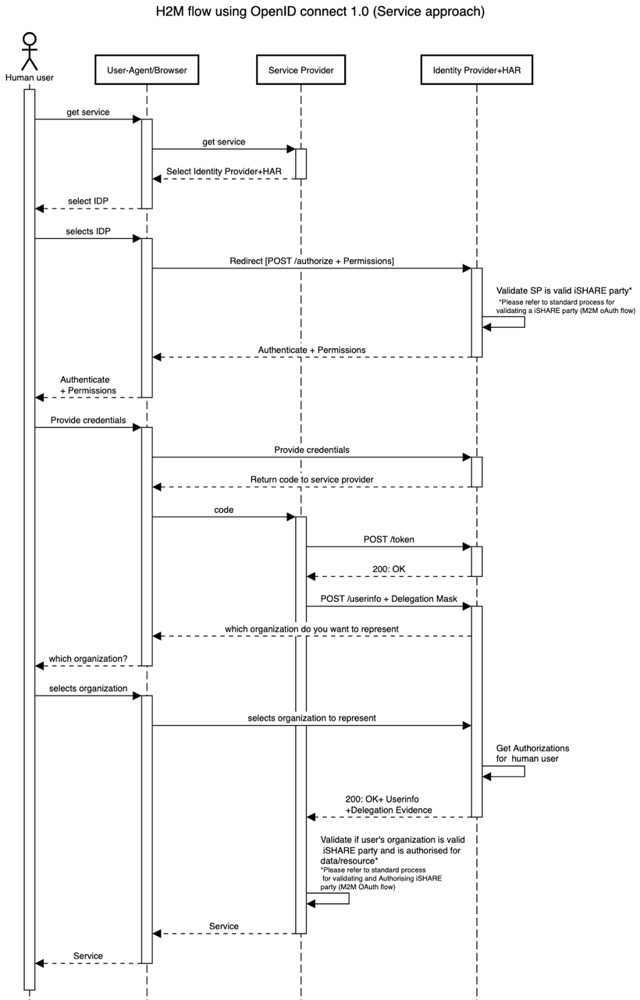
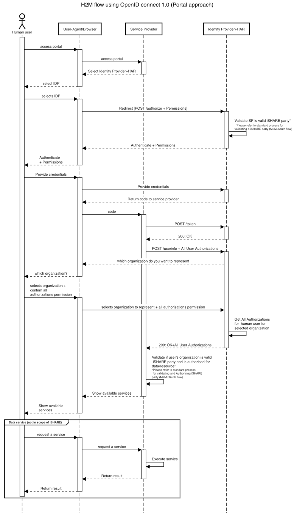

.. _refH2MAuthorization:

Authorization
=============

Besides authorization on an organisational level, within iSHARE it is also possible to authorize humans to act on behalf of another organisation. The generic OpenID Connect 1.0 flow does not take into account Authorizations of a human. However, in iSHARE it is essential that authorizations of a user are combined with their identity details before a service can be offered.

Within iSHARE, authorizations of a human are registered at an Identity Provider, and are retrieved using the :ref:`userinfo endpoint<refUserInfoEndpoint>`. For this purpose, there are some modifications to the OpenID Connect Flow. User identities are protected by sharing pseudonyms in order to comply with privacy requirements. Authorization of a human is done by replacing the 'accessSubject' value on the root level in delegationEvidence with an :ref:`iSHARE pseudonym of the human user<refHumanPseudonym>`.

In some cases, it is necessary to encrypt JWTs. The `JWE specification <https://tools.ietf.org/html/rfc7516>`_ is introduced for this. This is necessary in order to prevent unsuspecting users or Identity Brokers from being able to read and infer data not meant for them.

Broadly, user's interaction with the service provider can happen in 2 ways:

:ref:`The service specific approach<refServiceSpecificApproach>`.
    The user has the specific link to a specific service and is only interested in using that service. The service provider only needs to check if the human user is authorized to access this service.
:ref:`The portal approach<refPortalApproach>`.
    The user uses a portal to access a service. The Service Provider needs to know the authorizations of the user in order to only show services available to the user.

.. _refServiceSpecificApproach:

Service Specific Approach
-------------------------

In the service specific approach, the Service Provider will ask for a specific authorization of the human user in the request parameter of the :ref:`userinfo endpoint<refUserInfoEndpoint>`. This request closely follows the :ref:`delegation mask specification<refDelegationRequest>`. However, the value for the ``accessSubject`` on the root level of the delegationEvidence is replaced with the :ref:`iSHARE pseudonym of the human user<refHumanPseudonym>`

.. _refPortalApproach:

Portal approach
---------------

In the portal approach, the Service Provider is allowed to do a wildcard request in the request parameter of the userinfo endpoint. This request closely follows the :ref:`delegation mask specification<refDelegationRequest>`. However, the value for the ``accessSubject`` on the root level of the delegationEvidence is replaced with the :ref:`iSHARE pseudonym of the human user<refHumanPseudonym>` The wildcard is allowed because the Service Provider needs to know all the authorizations of the human user in order to show them in the portal, before the human user can select the correct service. Since a human user would be representing only one company at a time, it is asker by the IDP to select the company it wants to represenent when the user identity is common for different companies it can represent.

