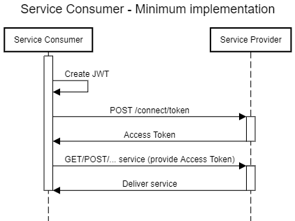
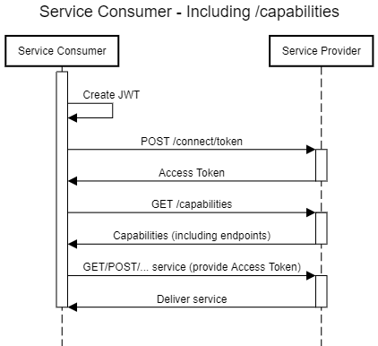
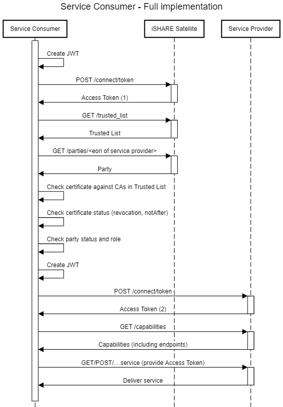
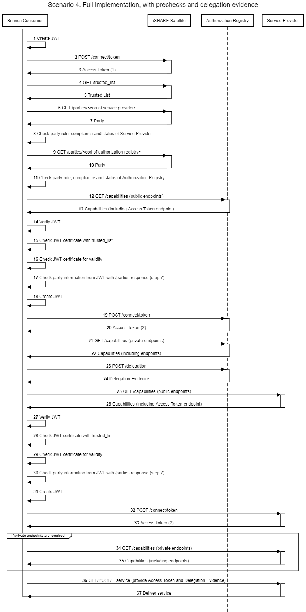

Getting Started
===============

This page describes the steps you have to undertake to consume services provided by iSHARE compliant Service Providers (this page assumes general knowledge of the `iSHARE framework and roles <https://framework.ishare.eu/is/framework-and-roles>`_).

Prerequisites
-------------

Make sure you execute the following steps before trying to consume services provided by iSHARE Providers.

.. list-table:: Consuming iSHARE services: prerequisites
   :widths: 30 35 35
   :header-rows: 1

   * - Step
     - iSHARE Staging
     - iSHARE Production
   * - Obtain a valid identity (private key + certificate)
     - `Click here <https://ca7.isharetest.net:8442/ejbca/ra/index.xhtml>`_ to request a test certificate. More information on :ref:`Get Test Certificate section<refGetTestCert>`.
     - Acquire a certificate from an eIDAS certificate provider.
   * - Register yourself as iSHARE Consumer
     - If you want to register at a specific iSHARE Satellite, contact the iSHARE Satellite through their communication channels. A registration via the Scheme Owner is also possible: contact us at support@ishare.eu. 
     - Register yourself with any iSHARE Satellite using their registration procedure.

Implementation
--------------

Every iSHARE Service Provider has implemented 2 standardised endpoints:
* Access Token (M2M)
* Capabilities

As an iSHARE Service Consumer, a minimum implementation requires connecting to the Access Token endpoint. For more information about requesting an Access Token, refer to the section about the :ref:`Access Token Endpoint<refM2MToken>`. The request includes an iSHARE JWT, which is documented :ref:`here<refJWT>`. After obtaining an Access Token, this token can be used to consume services from the Service Provider. These services themselves are not standardised by iSHARE. 

For your implementation, choose one of the following scenarios. A combination of scenarios is possible.

Scenario 1: Minimum implementation
~~~~~~~~~~~~~~~~~~~~~~
The endpoint and specifications of the service that will be consumed are already available. Delegation evidence is acquired by the Service Provider.

*Connection with the Service Provider*

#. :ref:`Get Access Token<refM2MToken>`
#. Use Access Token to consume service

Scenario 2: Using the /capabilities endpoint to discover services
~~~~~~~~~~~~~~~~~~~~~~~~~~~~~~~~~~~~~~~~~~~~~~~~~~~~~~~~~~~~~~~~~
The endpoints of the service that will be consumed are obtained through the /capabilities endpoint. Further specifications are assumed already available. Delegation evidence is acquired by the Service Provider.

*Connection with the Service Provider*

#. Consume /capabilities endpoint to discover where to get an Access Token
#. :ref:`Get Access Token<refM2MToken>`
#. Use Access Token to consume /capabilities endpoint to discover where to consume services
#. Use result of /capabilities endpoint + Access Token to consume services

Scenario 3: Perform prechecks on the Service Provider
~~~~~~~~~~~~~~~~~~~~~~~~~~~~~~~~~~~~~~~~~~~~~~~~~~~~~
If the Service Consumer provides data to a Service Provider (i.e. data that belongs to an Entitled Party), for full legal coverage it is advised to check adherence of the Service Provider, before a service is consumed. The implementation would then be as follows.

*Connection with iSHARE Satellite*

#. :ref:`Get Access Token<refM2MToken>`
#. Use Access Token to request the /trusted_list endpoint
#. Validate adherence of the Service Provider by invoking the /parties endpoint, searching for the EORI of the Service Provider that should be used at the Satellite. Check if the party can be found, if the certificate is valid (check with trusted list) and if the party has the role of Service Provider.

*Connection with the Service Provider*

#. :ref:`Get Access Token<refM2MToken>`
#. Use Access Token to consume service

Scenario 4: Full implementation, with prechecks and delegation evidence
~~~~~~~~~~~~~~~~~~~~~~~~~~~~~~~~~~~~~~~~~~~~~~~~~~~~~~~~~~~~~~~~~~~~~~~
If the Service Consumer wishes to provide delegation evidence to the Service Provider, the minimum implementation is as follows.

*Connection with iSHARE Satellite*

#. :ref:`Get Access Token<refM2MToken>`
#. Use Access Token to request the /trusted_list endpoint
#. Validate adherence of the Authorization Registry by invoking the /parties endpoint, searching for the EORI of the Authorization Registry that should be used at the Satellite. Check if the party can be found, if the certificate is valid (check with trusted list) and if the party has the role of Authorization Registry.
#. Validate adherence of the Service Provider by invoking the /parties endpoint, searching for the EORI of the Service Provider that should be used at the Satellite. Check if the party can be found, if the certificate is valid (check with trusted list) and if the party has the role of Service Provider.

*Connection with the Authorization Registry*

#. :ref:`Get Access Token<refM2MToken>`
#. Use the Access Token to invoke the Delegation endpoint, to obtain Delegation Evidence

*Connection with the Service Provider*

#. :ref:`Get Access Token<refM2MToken>`
#. Use Access Token and Delegation Evidence to consume service

