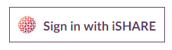
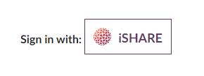
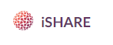

.. _refSignIn:

Sign-In Button
==============

Follow these guidelines for iSHARE sign-in button 

SVG files are available to download:

* :download:`Only logo <resources/ishare only logo.svg>`
* :download:`Logo with iSHARE at the bottom <resources/ishare logo bottom.svg>`
* :download:`Logo with iSHARE at the right <resources/ishare logo right.svg>`

Equal prominence
----------------

The iSHARE Sign-In button must be displayed at least as prominently as other third party sign-in options. For example, buttons should be approximately the same size and have similar visual weight.

Matching your own app's style
-----------------------------

Using the standard iSHARE Sign-In button is strongly recommended as it enables iSHARE users to more quickly identify the iSHARE option. If you need to adapt the button to match your app design or translate the text "Sign in with" or "Sign in", follow these guidelines.

Size
^^^^

You can scale the button as needed for different devices and screen sizes, but you must preserve the aspect ratio so that the iSHARE logo is not stretched.

Text
^^^^

To encourage users to click the button, we recommend the call-to-action text "Sign in with iSHARE". It should be clear to the user that they are signing in to your app for your app with their iSHARE credentials.

"iSHARE" Text
^^^^^^^^^^^^^

You can use the word "iSHARE" by itself in the button if it is accompanied by adjacent text that makes it clear what the action is. For example:

 
Colour
^^^^^^

The colour for an unpressed button is #FFFFFF (white). The colour of button text colour is #61385F (dark purple). The button must always include the standard colour iSHARE logo.

.. note:: Dark mode is not yet ready. 

Font
^^^^

The button font-family is Lato and font-weight is 700. Do not use other fonts on the button, except as noted for situations with Matching your own app's style. 

Padding
^^^^^^^

The padding to the left, right, top and bottom of the text should be 12px. The logo should be 25px size, text "iSHARE" should be 18px. There should be 12px space between the logo and the button text. If you need the sign-in button to be smaller or bigger, keep the same proportions.

iSHARE logo in the "Sign in with iSHARE" button
^^^^^^^^^^^^^^^^^^^^^^^^^^^^^^^^^^^^^^^^^^^^^^^

Regardless of the text, you can't change the size or colour of the iSHARE logo. It must be the standard colour version and appear on a white background.

Incorrect button design
-----------------------

* Do not use the iSHARE icon or logo by itself without the button boundary and without text to indicate the user action.

* Do not use an iSHARE icon by itself to represent iSHARE Sign-In.

* Do not put the iSHARE icon on a coloured background.

* Do not create your own icon for the button.

* Do not recolour the icon of iSHARE

